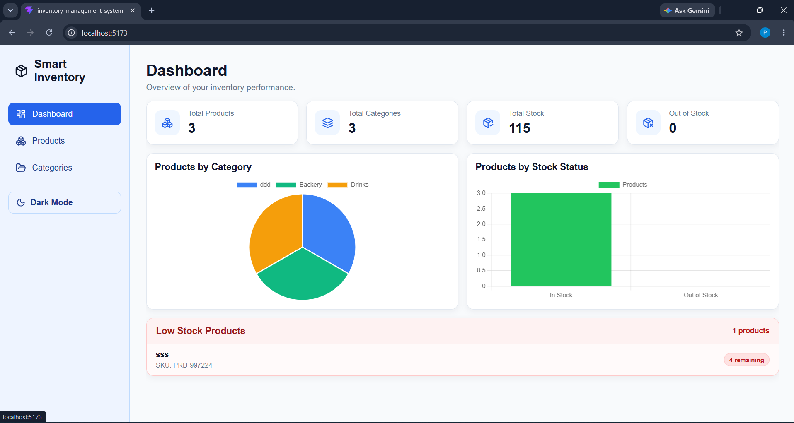
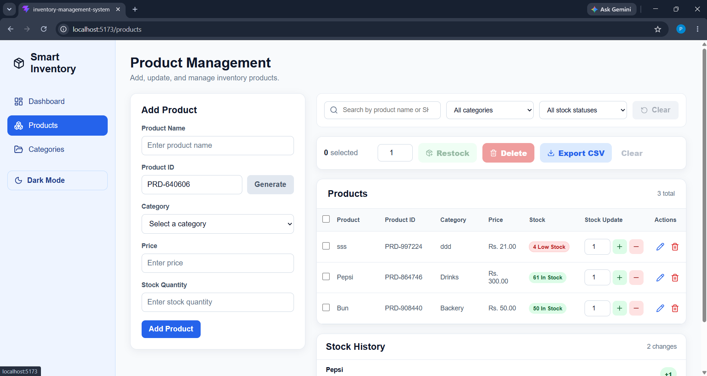
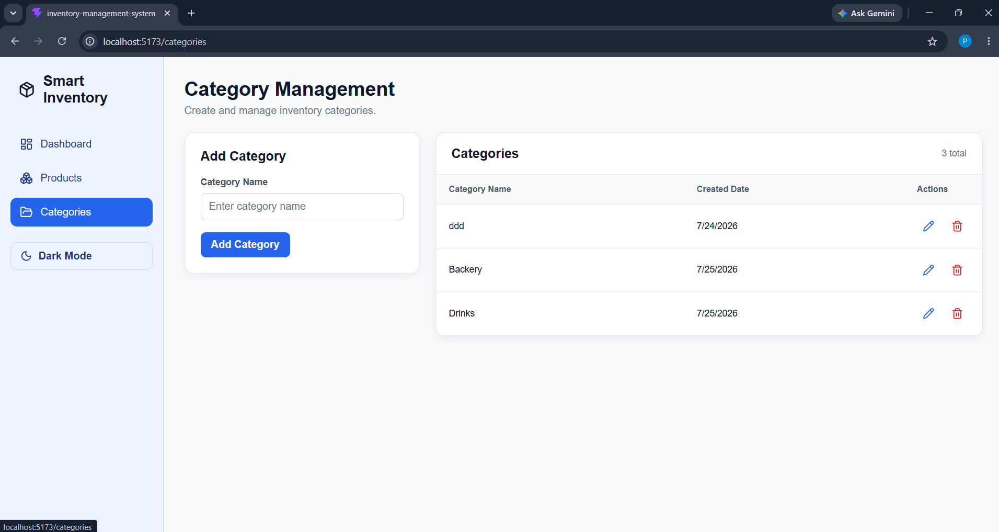
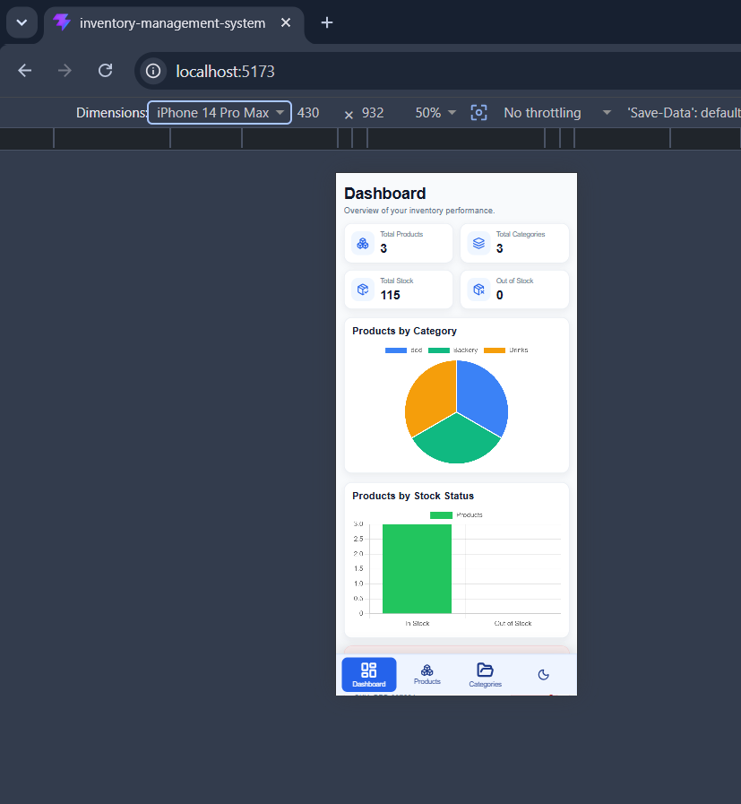
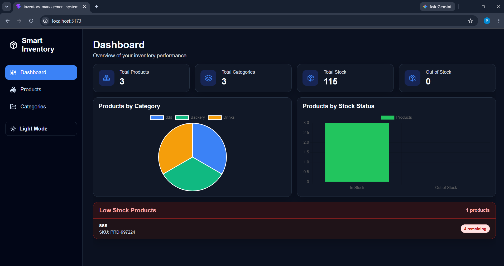

# Inventory Management System

A responsive frontend inventory management application built with React, TypeScript, and Vite. The app helps manage product categories, product records, stock levels, stock history, filtering, exports, and dashboard analytics using browser `localStorage`.

## How to Run Locally

1. Install dependencies:

```bash
npm install
```

2. Start the development server:

```bash
npm run dev
```

3. Open the local URL shown in the terminal, usually:

```bash
http://localhost:5173
```

4. Build for production:

```bash
npm run build
```

5. Run lint checks:

```bash
npm run lint
```

## Features

- Dashboard with summary cards for total products, categories, stock, and out-of-stock products
- Products by category pie chart
- Products by stock status bar chart
- Low-stock product warning section
- Category create, edit, delete, and duplicate-name validation
- Product create, edit, delete, and duplicate-SKU validation
- Product filtering by search term, category, and stock status
- Stock increase/decrease controls per product
- Stock history log with timestamps
- Bulk product selection
- Bulk restock for selected products
- Bulk delete for selected products
- Export full product list to CSV
- Confirmation modal for delete actions
- Toast notifications for success and error feedback
- Light mode and dark mode with saved preference
- Responsive desktop, tablet, and mobile layouts
- Local data persistence with `localStorage`

## Screenshots

### Dashboard



### Products Page



### Categories Page



### Mobile View



### Dark Mode


